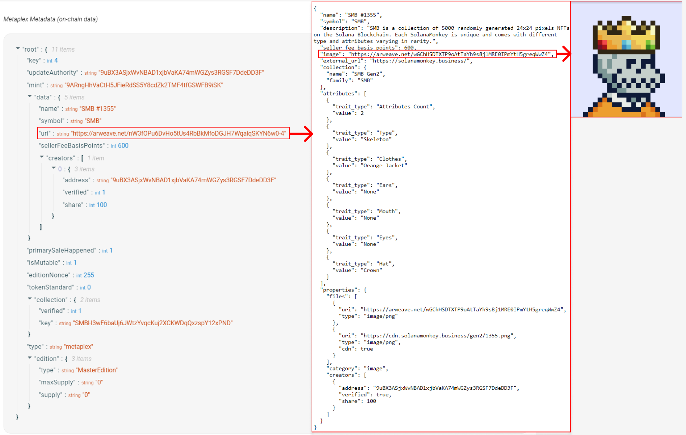

## Create Solana NFTs With Metaplex

- `Non-Fungible Token (NFTs)`: Solana'da ilişkili bir meta veri hesabı, O ondalık basamak ve maksimum 1 arz ile SPL Token'ları olarak temsil edilir.

- `Metaplex`, Solana blok zincirinde NFT'lerin oluşturulmasını ve dağıtımını basitlerştiren bir araç koleksiyınu sunuyor.

- `Token Meta Veri programı`, meta verilerin SPL Token'larına eklenmesi sürecini standart hale getirir

- `Metaplex SDK`, geliştiricilerin Metaplex tarafından sağlanan zincir içi araçları kullanmalarına yardımcı olmak için kullanıcı dostu API'ler sunan bir araçtır

- ` Candy Machine programı`, bir koleksiyondan NFT'ler oluşturmak ve basmak için kullanılan bir NFT dağıtım aracıdır

- `Sugar CLI`, medya/meta veri dosyalarını yükleme ve bir koleksiyon için bir Şekerleme Makinesi oluşturma sürecini basitleştiren bir araçtır.

### Lesson

Solana Non-Fungible Token'lar (NFT'ler), Token programı kullanılarak oluşturulan SPL token'lardır. Ancak bu token'ların her token basımıyla ilişkili ek bir meta veri hesabı da vardır. Bu token'lar çeşitli kullanım durumlarına olanak tanır. Oyun envanterinden sanata kadar her şeyi etkili bir şekilde tokenlaştırabilirsiniz.

## Solana'dali NFT'ler

Solana NFT, ilişkili meta verileri olan bölünemez bir tokendır. Ayrıca, tokenin basımının maksimum arzı 1'dir.

Başka bir deyişle, NFT, Token Programı'ndaki standart bir token'dır ancak "standart token" olarak düşündüğünüz token'lardan şu şekilde farklıdır:

1. 0 ondalık basamağa sahip olduğundan parçalara bölünemez

2. 1 adet arzı olan bir token basımından gelir, bu nedenle bu tokenlerden yalnızca 1 tanesi mevcuttur

3. Yetkisi sıfır olarak ayarlanmış bir token basımından gelir (arzın asla değişmemesini sağlamak için)

4. Meta verileri depolayan ilişkili bir hesabı var

İlk üç madde SPL Token Programı ile elde edilebilecek özellikler olmakla birlikte, ilişkili meta veriler bazı ek işlevler gerektirmektedir.

Tipik olarak, bir NFT'nin meta verisi hem zincir içi hem de zincir dışı bir bileşene sahiptir. Aşağıdaki şemaya bakın:



- `The onchain metadata` (zincir üstü meta verileri) token mint ile ilişkili bir hesapta saklanır. Zincir üstü meta verileri zincir dışı `.json` dosyasına işaret eden bir URI alanı içerir

- `The off-chain metadata`: JSON dosyasındaki zincir dışı meta veriler, NFT'nin medyasına (görüntüler, videolar, 3B dosyalar) NFT'nin sahip olabileceiği herhangi bir özelliğe ve ek meta verilere ([bu örnek JSON dosyasına bakın](https://lsc6xffbdvalb5dvymf5gwjpeou7rr2btkoltutn5ij5irlpg3wa.arweave.net/XIXrlKEdQLD0dcML01kvI6n4x0GanLnSbeoT1EVvNuw)) bağlantıyı depolar. Arweave gibi kalıcı veri depolama sistemleri genellikle NFT meta verilerinin zincir dışı bileşenini depolamak için kullanılır.

## Metaplex

Metaplex Solana Blok Zincirinde NFT'lerin oluşturulmasını ve dağıtımını basitleştiren Meatplex SDK gibi bir dizi araç sağlayan bir organizasyondur. Bu araçlar çok çeşitli kullanım durumlarına hitap eder ve NFT koleksiyonu oluşturma ve basma gibi tüm NFT sürecini kolayca yönetmenize olanak tanır.

[Daha spesifik olarak, Metaplex SDK, geliştiricilerin Metaplex tarafından sunulan zincir üstü araçları kullanmalarına yardımcı olmak için tasarlanmıştır. Popüler kullanım durumlarına odaklanan ve üçüncü taraf eklentilerle kolay entegrasyona izin veren kullanıcı dostu bir API sunar. Metaplex SDK'nın yetenekleri hakkında daha fazla bilgi edinmek için README'ye başvurabilirsiniz .](https://github.com/metaplex-foundation/js#readme)

Metaplex tarafından sunulan temel programlardan biri Token Metadata programıdır. Token Metada programı meta verileri Spl Tokenalarına ekleme süreciini standartlaştırır. Metaplex ile bir NFT oluştururken, Token Metadata programı, (Token Mint) token darphanesini tohum olarak kullanarak (Program Derived Address) Programdan Türetilmiş Adres (PDA) kullanarak bir meta veri hesabı oluşturur. Bu herhangi bir NFT için meta veri hesabının (token mint) token darphanesinin adresini kullanarak kesın olarak bulunmasını sağlar. Token Metadata programı hakkında daha fazla bilgi edinmek için Metaplex belgelerine [başvurabilirsiniz](https://developers.metaplex.com/)

Aşağıdaki bölümlerde, varlıkları hazırlamak, NFT'ler oluşturmak, NFT'leri güncellemek ve bir NFT'yi daha geniş bir koleksiyonla ilişkilendirmek için Metaplex SDK'yı kullanmanın temellerini ele alacağız.

Bir metaplex örneği Metaplex SDK Apılerine erişim için giriş noktası görevi görür. BU örnek kümeyle iletişim kurmak için kullanılan bir bağlantıyı kabul eder. Ek olarak geliştiriciler bir `Kimlik Sürücüsü` ve bir `Depolama Sürücüsü` ("Identity Driver" and a "Storage Driver".) belirterek SDK'nın etkileşimlerini özelleştirebilir.

- `Identity Driver (Kimlik Sürücüsü)` bir NFT oluştururkem gerekli olan işlemleri imzalamak için kullanılabilen bir anahtar çiftidir

- `Storage Driver (Depolama Sürücüsü)` varlıkları yüklemek için kullanmak istediğiniz depolama hizmetini belirtmek için kullanılır. `bundlrStorage` sürücüsü varsayılan seçenektir ve varlıkları kalıcı ve merkezi olmayan bir depolama hizmeti olan Arweave'e yükler.

Aşağıda Metaplex örneğini devnet için nasıl kurabileceğinize dair bir örnek verilmiştir .

```ts
import {
  Metaplex,
  keypairIdentity,
  bundlrStorage,
} from "@metaplex-foundation/js";
import { Connection, clusterApiUrl, Keypair } from "@solana/web3.js";

const connection = new Connection(clusterApiUrl("devnet"));
const wallet = Keypair.generate();

const metaplex = Metaplex.make(connection)
  .use(keypairIdentity(wallet))
  .use(
    bundlrStorage({
      address: "https://devnet.bundlr.network",
      providerUrl: "https://api.devnet.solana.com",
      timeout: 60000,
    })
  );
```

## Upload Assets

Bir NFT oluşturabilmeniz için, NFT ile ilişkilendirmeyi planladığınız tüm varlıkları hazırlamanız ve yüklemeniz gerekir. Bunun bir görüntü olması gerekmese de, çoğu NFT'nin ilişkilendirilmiş bir görüntüsü vardır.

Bir görüntünün hazırlanması ve yüklenmesi, görüntünün bir tampon belleğe dönüştürülmesini, _`toMetaplexFile`_ fonksiyonu kullanılarak Metaplex formatına dönüştürülmesini ve son olarak belirlenen Depolama Sürücüsüne yüklenmesini içerir.

Metaplex SDK, yerel bilgisayarınızda bulunan dosyalardan veya bir kullanıcı tarafından tarayıcı aracılığıyla yüklenen dosyalardan yeni bir Metaplex dosyası oluşturulmasını destekler.

İlkini, görüntü dosyasını okumak için `fs.readFileSync'i ` kullanarak ve ardından `toMetaplexFile` kullanarak bir `Metaplex` dosyasına dönüştürerek yapabilirsiniz.

Son olarak, dosyayı yüklemek için storage().upload(file)' ı çağırmak üzere Metaplex örneğinizi kullanın . İşlevin dönüş değeri, görüntünün depolandığı URI olacaktır.

```ts
const buffer = fs.readFileSync("/path/to/image.png");
const file = toMetaplexFile(buffer, "image.png");

const imageUri = await metaplex.storage().upload(file);
```

## Upload Metadata

Bir resim yükledikten sonra, `nfts().uploadMetadata ` fonksiyonunu kullanarak `off-chain` JSON meta verilerini yükleme zamanı . Bu, JSON meta verilerinin depolandığı bir URI döndürecektir.

Unutmayın, meta verilerin zincir dışı kısmı, resim URI'si gibi şeylerin yanı sıra NFT'nin adı ve açıklaması gibi ek bilgileri de içerir. Teknik olarak bu JSON nesnesine istediğiniz her şeyi dahil edebilmenize rağmen, çoğu durumda cüzdanlar, programlar ve uygulamalarla uyumluluğu sağlamak için [NFT standardını](https://developers.metaplex.com/#the-non-fungible-standard) takip etmelisiniz .

Meta verileri oluşturmal için SDK tarafından sağlanan `uploadMeatadata` yöntemini kullanın. Bu yöntem bir meta veri nesnesi kabul eder ve yüklenen meta verilere işaret eden bir URI döndürür

```ts
const { uri } = await metaplex.nfts().uploadMetadata({
  name: "My NFT",
  description: "My description",
  image: imageUri,
});
```

## Create NFT

NFT'nin meta verilerini yükledikten sonra, sonunda ağda NFT'yi oluşturabilirsiniz. Metaplex SDK'nın oluşturma yöntemi, minimum yapılandırmayla yeni bir NFT oluşturmanıza olanak tanır. Bu yöntem, sizin için (token mint) darphane hesabı, token hesabı, meta veri hesabı ve ana sürüm hesabının oluşturulmasını halleder. Bu yönteme sağlanan veriler, NFT meta verilerinin zincir içi bölümünü temsil edecektir. Bu yönteme isteğe bağlı olarak sağlanabilecek diğer tüm girdileri görmek için SDK'yı inceleyebilirsiniz.

```ts
const { nft } = await metaplex.nfts().create(
  {
    uri: uri,
    name: "My NFT",
    sellerFeeBasisPoints: 0,
  },
  { commitment: "finalized" }
);
```

Bu yöntem yeni oluşturulan NFT hakkında bilgi içeren bir nesne döndürür. Varsayılan olarak SDK `isMutable` özelliğini true olarak ayarlar ve NFT'nin meta verilerinde güncellemeler yapılmasına olanak tanır. Ancak, `isMutable özelliğini ` fasle olarak ayarlamayı seçebilir ve NFT'nin meta verilerini değiştirilemez hale getirebilirsiniz.

## Update NFT

`isMutable` true olarak bıraktıysanız, NFT'nizin meta verilerini güncelleme için bir nedeniniz olabilir. SDK'nın güncelleme yöntemi. NFT'nin meta verilerinin hem zincir içi hem de zincir dışı kısımlarını güncellemenize olanaka tanır. Zincir dışı meta verileri güncellemek için, önceki adımlarda belirtildiği gibi yeni bir resim ve meta veri URI'si yükleme adımlarını tekrarlamanız ve ardından bu yönteme yeni meta veri URI'sini sağlamanız gerekir. Bu zincir içi meta verilerinin işaret ettiği URI'yi değiştirir ve zincir dışı meta verileri de etkili etili bir şekilde günceller.

```ts
const nft = await metaplex.nfts().findByMint({ mintAddress });

const { response } = await metaplex.nfts().update(
  {
    nftOrSft: nft,
    name: "Updated Name",
    uri: uri,
    sellerFeeBasisPoints: 100,
  },
  { commitment: "finalized" }
);
```

- Güncelleme çağrısına dahil etmediğiniz alanların tasarım gereği aynı kalacağını unutmayın

## Add NFT to Collection

Onaylı Koleksiyon bireysel NFT'lerin ait olabileceği bir NFT'dir. Solana Monkey Business gibi büyük bir NFT koleksiyonunu düşünün. Bireysel bir NFT'nin Meta Verilerin bakarsanın.`Onaylı Koleksiyon`NFT'sine işaret eden bir `anahtara` sahip bir `koleksiyon` alanı göreceksiniz . Basitçe söylemek gerekirse, bir koleksiyonun parçası olan NFT'ler, koleksiyonun kendisini temsil eden başka bir NFT ile ilişkilendirilir.

Bir koleksiyona NFT eklemek için öncellikle Koleksiyon NFT'si oluşturulmalıdır. İşlem öncekiyle aynıdır, ancak NFT meta verilerimiz bir ek alan ekleyeceksiniz: `isCollection`. Bu alan, token programına bu NFT'nin bir Koleksiyon NFT'si olduğunu söyler.

```ts
const { collectionNft } = await metaplex.nfts().create(
  {
    uri: uri,
    name: "My NFT Collection",
    sellerFeeBasisPoints: 0,
    isCollection: true,
  },
  { commitment: "finalized" }
);
```

Daha sonra koleksiyonun Darphane Adresini (Token Mint) yeni NFT'mizdeki koleksyion alanı için referans olarak listeleyin.

```ts
const { nft } = await metaplex.nfts().create(
  {
    uri: uri,
    name: "My NFT",
    sellerFeeBasisPoints: 0,
    collection: collectionNft.mintAddress,
  },
  { commitment: "finalized" }
);
```

Yeni oluşturduğunuz NFT'nizin meta verilerini kontrol ettiğinizde artık aşağıdali gibi bir koleksiyon alanı görmelisiniz.

```ts
"collection":{
  "verified": false,
  "key": "SMBH3wF6baUj6JWtzYvqcKuj2XCKWDqQxzspY12xPND"
}
```

Yapmanız gereken son şey NFT'yi doğrulamaktır. Bu, etkili bir şekilde yukarıdaki doğrulanmış alanı doğruya çevirir, ancak inanılmaz derecede önemlidir. Bu, tüketen programların ve uygulamaların NFT'nizin aslında koleksiyonun bir parçası olduğunu bilmesini sağlar. Bunu `verifyCollection` işlevini kullanarak yapabilirsiniz:

```ts
await metaplex.nfts().verifyCollection({
  mintAddress: nft.address,
  collectionMintAddress: collectionNft.address,
  isSizedCollection: true,
});
```

## Candy Machine

Toplu NFT'ler oluştururken ve dağıtırken Metaplex, [Candy Machine](https://docs.metaplex.com/programs/candy-machine/overview) programı ve Sugar CLI ile işinizi kolaylaştırıyor .

Candy Machine, NFT koleksiyonlarını başlatmaya yardımcı olmak için etkili bir şekilde bir basım ve dağıtım programıdır. Sugar, bir şeker makinesi oluşturmanıza, varlıkları hazırlamanıza ve büyük ölçekte NFT oluşturmanıza yardımcı olan bir komut satırı arayüzüdür. Bir NFT oluşturmak için yukarıda ele alınan adımlar, tek seferde binlerce NFT için yürütülmesi inanılmaz derecede sıkıcı olacaktır. Candy Machine ve Sugar bunu çözer ve bir dizi güvenlik önlemi sunarak adil bir lansman sağlamaya yardımcı olur.

Bu araçları derinlemesine incelemeyeceğiz ancak Candy Machine ve Sugar'ın birlikte nasıl çalıştığını Metaplex dokümanlarından inceleyebilirsiniz .

Metaplex'in sunduğu araçların tamamını keşfetmek için GitHub'daki[ Metaplex deposunu](https://github.com/metaplex-foundation/metaplex) inceleyebilirsiniz .

## Lab

Bu laboratuvarda, Metaplex SDK kullanarak bir NFT oluşturma adimlarını ele alacağız. NFT'nin meta verilerini daha sonra güncelleyeceğiz ve ardından NFT'yi bir koleksiyonla ilişkilendireceğiz. Sonunda Solanadaki NFT'lerle etkileşim kurmak için Metaplex SDK'yı nasıl kullanacağınıza dair temel bir anlayışa sahip olacaksınız.

### Starter

Başlamak için, başlangıç ​​kodunu bu deponun starter dalından indirin .

Projede NFT'ler için kullanacağımız iki adet görsel src dizininde bulunmaktadır.

Ayrıca index.ts dosyasında, oluşturacağımız ve güncelleyeceğimiz NFT için örnek verileri içeren aşağıdaki kod parçacığını bulacaksınız.

```ts
interface NftData {
  name: string;
  symbol: string;
  description: string;
  sellerFeeBasisPoints: number;
  imageFile: string;
}

interface CollectionNftData {
  name: string;
  symbol: string;
  description: string;
  sellerFeeBasisPoints: number;
  imageFile: string;
  isCollection: boolean;
  collectionAuthority: Signer;
}

// example data for a new NFT
const nftData = {
  name: "Name",
  symbol: "SYMBOL",
  description: "Description",
  sellerFeeBasisPoints: 0,
  imageFile: "solana.png",
};

// example data for updating an existing NFT
const updateNftData = {
  name: "Update",
  symbol: "UPDATE",
  description: "Update Description",
  sellerFeeBasisPoints: 100,
  imageFile: "success.png",
};

async function main() {
  // create a new connection to the cluster's API
  const connection = new Connection(clusterApiUrl("devnet"));

  // initialize a keypair for the user
  const user = await initializeKeypair(connection);

  console.log("PublicKey:", user.publicKey.toBase58());
}
```

Gerekli bağımlılıkları kurmak için komut satırında npm install komutunu çalıştırın.

Sonra, npm start komutunu çalıştırarak kodu çalıştırın . Bu, yeni bir anahtar çifti oluşturacak, bunu .env dosyasına yazacak ve anahtar çiftine devnet SOL'u airdrop edecektir.

```sh
Current balance is 0
Airdropping 1 SOL...
New balance is 1
PublicKey: GdLEz23xEonLtbmXdoWGStMst6C9o3kBhb7nf7A1Fp6F
Finished successfully
```

### Metaplex'i Kurun

NFT'leri oluşturmaya ve güncellemye başlamadan önce Metaplex örneğini ayarlamamız gerekiyor. `main()` fonksiyonunu aşağıdakilerle güncelleyin.

```ts
async function main() {
  // create a new connection to the cluster's API
  const connection = new Connection(clusterApiUrl("devnet"));

  // initialize a keypair for the user
  const user = await initializeKeypair(connection);

  console.log("PublicKey:", user.publicKey.toBase58());

  // metaplex set up
  const metaplex = Metaplex.make(connection)
    .use(keypairIdentity(user))
    .use(
      bundlrStorage({
        address: "https://devnet.bundlr.network",
        providerUrl: "https://api.devnet.solana.com",
        timeout: 60000,
      })
    );
}
```

3.  ### `uploadMetadata yardımcı fonksiyonu`

Sonra bir resim ve meta veri yüklemeyi ve meta veri URI'sini döndürmeyi idare edecek bir yardımcı fonksiyon oluşturalım. Bu fonksiyon Metaplex örenğini ve NFT verilerini girdi olarak alacak ve meta veri URI'sini çıktı olarak döndürecektir.

```ts
// helper function to upload image and metadata
async function uploadMetadata(
  metaplex: Metaplex,
  nftData: NftData
): Promise<string> {
  // file to buffer
  const buffer = fs.readFileSync("src/" + nftData.imageFile);

  // buffer to metaplex file
  const file = toMetaplexFile(buffer, nftData.imageFile);

  // upload image and get image uri
  const imageUri = await metaplex.storage().upload(file);
  console.log("image uri:", imageUri);

  // upload metadata and get metadata uri (off chain metadata)
  const { uri } = await metaplex.nfts().uploadMetadata({
    name: nftData.name,
    symbol: nftData.symbol,
    description: nftData.description,
    image: imageUri,
  });

  console.log("metadata uri:", uri);
  return uri;
}
```

Bu fonksiyon bir görüntü dosyasını okuyacak, onu bir arabelleğe dönüştürecek ve ardından bir görüntü URI'si almak için yükleyecektir. Daha sonra, adı, sembolü, açıklamayı ve görüntü URI'sini içeren NFT meta verilerini yükleyecek ve bir meta veri URI'si alacaktır. Bu URI, zincir dışı meta veridir. Bu fonksiyon ayrıca referans için görüntü URI'sini ve meta veri URI'sini günlüğe kaydedecektir.

5.  ### createNft yardımcı Fonksiyonu

Sonraa NFT'iy oluşturmayı ele almak için bir yardımcı fonksiyon oluşturalım. Bu fonksiyon Metaplex örneğini meta veri URI'sini vee NFT verilerini girddi olarak alır. NFT'yi oluşturmak için SDK'nin `create` metodu kullanır ve meta veri URI'sini adı, satıcı ve ücretini ve sembolü parametre olarak geçirir.

```ts
// // helper function create NFT
async function createNft(
  metaplex: Metaplex,
  uri: string,
  nftData: NftData
): Promise<NftWithToken> {
  const { nft } = await metaplex.nfts().create(
    {
      uri: uri, // metadata URI
      name: nftData.name,
      sellerFeeBasisPoints: nftData.sellerFeeBasisPoints,
      symbol: nftData.symbol,
    },
    { commitment: "finalized" }
  );

  console.log(
    `Token Mint: https://explorer.solana.com/address/${nft.address.toString()}?cluster=devnet`
  );

  return nft;
}
```

`createNft` işevi, token mint URL'sini günlüğe kaydeder ve yeni oluşturulan NFT hakkında bilgi içeren bir `nft` nesnesi döndürür. NFT, Metaplex örneğini kurarken Kimlik Sürücüsü olarak kullanılan `kullanıcıya ` karşılık gelen anahtara basılır.

6.  ### NFT Oluşturuun- Create NFT
    Artık metaplex örneği kurduğumuz ve meta veri yüklemek ve Nft oluşturmak için yardımcı işlevler oluştruduğumuz göre bu işlevleri bir NFT oluşturarak test edebilirz. main işlevinde NFT verilerini yüklemek ve meta veri URI'sini almak için `uploadMetadata` işevini çağırın. Ardından bir nft oluşturmak için `createNft` işlevini ve metaveri Uri'sini kullanın.

```ts
async function main() {
	...

// upload the NFT data and get the URI for the metadata
const uri = await uploadMetadata(metaplex, nftData)

// create an NFT using the helper function and the URI from the metadata
const nft = await createNft(metaplex, uri, nftData)
}
```

Ana işlevi yürütmek için komut satırında npm start komutunu çalıştırın . Aşağıdakine benzer bir çıktı görmelisiniz:

```sh
Current balance is 1.770520342
PublicKey: GdLEz23xEonLtbmXdoWGStMst6C9o3kBhb7nf7A1Fp6F
image uri: https://arweave.net/j5HcSX8qttSgJ_ZDLmbuKA7VGUo7ZLX-xODFU4LFYew
metadata uri: https://arweave.net/ac5fwNfRckuVMXiQW_EAHc-xKFCv_9zXJ-1caY08GFE
Token Mint: https://explorer.solana.com/address/QdK4oCUZ1zMroCd4vqndnTH7aPAsr8ApFkVeGYbvsFj?cluster=devnet
Finished successfully
```
Görüntü ve meta veriler için oluşturulan URI'leri incelemekten çekinmeyin, ayrıca çıktıda verilen URL'yi ziyaret ederek Solana Explorer'da NFT'yi görüntüleyebilirsiniz.

7. updateNftUri;


Sonra mevcut bir NFT'nin URI'sini güncellemeyi ele almak için bir yardımcı foksiyon oluşturalım. BU fonksiyon, NFT'nin Metaplex örneğini meta veri URI'sini ve mint (darphane) adresini alacaktır.  Mint (darphane) adresini kullanarak mevcut NFT verilerini almak için SDK'nın `findByMint` metodunu ve ardından meta veriyi yeni URI ile güncellemek için update metodunu kullanır. Son olarak referans iiçin token darphane (mint) URL'sini ve işlem imzasını günlüğe kaydedecektir.

```ts
// helper function update NFT
async function updateNftUri(
  metaplex: Metaplex,
  uri: string,
  mintAddress: PublicKey,
) {
  // fetch NFT data using mint address
  const nft = await metaplex.nfts().findByMint({ mintAddress });

  // update the NFT metadata
  const { response } = await metaplex.nfts().update(
    {
      nftOrSft: nft,
      uri: uri,
    },
    { commitment: "finalized" },
  );

  console.log(
    `Token Mint: https://explorer.solana.com/address/${nft.address.toString()}?cluster=devnet`,
  );

  console.log(
    `Transaction: https://explorer.solana.com/tx/${response.signature}?cluster=devnet`,
  );
}
```

8. ### NFT'yi güncelleyin

Mevctu bir NFT'yi güncellemek için öncellikle NFT için yeni meta veri yüklememeiz ve yeni URI'yi almamız gerekir. `main()` fonksiyonunda, güncellenmiş NFT verisini yüklemek ve meta veri için yeni URI'yi almak için `uploadMetadata` foknsiyonunu tekrara çağırın. Daha sonra, Metaplex örneğini meta veriden yeni URI'yi ve NTF'nin (mint)  darphane adresini geçirerek updateNFTUri yardımcı fonksiyonunu kullanabilirsiniz. `nft.address`, `createNft` fonksiyonun çıktsındadır.

```ts
async function main() {
	...

  // upload updated NFT data and get the new URI for the metadata
  const updatedUri = await uploadMetadata(metaplex, updateNftData)

  // update the NFT using the helper function and the new URI from the metadata
  await updateNftUri(metaplex, updatedUri, nft.address)
}
```

Ana işlevi yürütmek için komut satırında npm start çalıştırın . Aşağıdakine benzer ek çıktılar görmelisiniz:


```bash
...
Token Mint: https://explorer.solana.com/address/6R9egtNxbzHr5ksnGqGNHXzKuKSgeXAbcrdRUsR1fkRM?cluster=devnet
Transaction: https://explorer.solana.com/tx/5VkG47iGmECrqD11zbF7psaVqFkA4tz3iZar21cWWbeySd66fTkKg7ni7jiFkLqmeiBM6GzhL1LvNbLh4Jh6ozpU?cluster=devnet
Finished successfully
```
Ayrıca .env dosyasından PRIVATE_KEY'i içe aktararak Phantom cüzdanındaki NFT'leri görüntüleyebilirsiniz .


9. ### Bir NFT koleksiyonu oluşturun

Harika artık tek bit NFT'yi nasıl oluşturacağınızı ve Solana blok zincrinde nasıl güncelleyeceğinizi biliyorsunuz. Bunu bir koleksiyona nasıl eklersiniz?

İlk olarak,`` createCollectionNft`` adında bir yardımcı fonksiyon oluşturalım . Bunun createNft ile çok benzer olduğunu , ancak isCollection'ın true olarak ayarlandığından ve verilerin bir koleksiyon için gerekliliklerle eşleştiğinden emin olduğunu unutmayın.

```ts
async function createCollectionNft(
  metaplex: Metaplex,
  uri: string,
  data: CollectionNftData
): Promise<NftWithToken> {
  const { nft } = await metaplex.nfts().create(
    {
      uri: uri,
      name: data.name,
      sellerFeeBasisPoints: data.sellerFeeBasisPoints,
      symbol: data.symbol,
      isCollection: true,
    },
    { commitment: "finalized" }
  )

  console.log(
    `Collection Mint: https://explorer.solana.com/address/${nft.address.toString()}?cluster=devnet`
  )

  return nft
}
```

Sonra, koleksiyon için zincir dışı verileri oluşturmamız gerekiyor. main'de createNft'ye yönelik mevcut çağrılardan önce , aşağıdaki collectionNftData'yı ekleyin :

```ts
const collectionNftData = {
  name: "TestCollectionNFT",
  symbol: "TEST",
  description: "Test Description Collection",
  sellerFeeBasisPoints: 100,
  imageFile: "success.png",
  isCollection: true,
  collectionAuthority: user,
}
```

Şimdi, uploadMetadata'yı collectionNftData ile çağıralım ve ardından createCollectionNft'yi çağıralım . Tekrar, bunu bir NFT oluşturan koddan önce yapalım.

```ts
async function main() {
  ...

  // upload data for the collection NFT and get the URI for the metadata
  const collectionUri = await uploadMetadata(metaplex, collectionNftData)

  // create a collection NFT using the helper function and the URI from the metadata
  const collectionNft = await createCollectionNft(
    metaplex,
    collectionUri,
    collectionNftData
  )
}
```


```ts
async function main() {
  ...

  // upload data for the collection NFT and get the URI for the metadata
  const collectionUri = await uploadMetadata(metaplex, collectionNftData)

  // create a collection NFT using the helper function and the URI from the metadata
  const collectionNft = await createCollectionNft(
    metaplex,
    collectionUri,
    collectionNftData
  )
}
```

Bu, koleksiyonumuzun mint adresini döndürecek ve bunu koleksiyona NFT atamak için kullanabileceğiz.

10. ### Bir NFT'yi bir koleksiyona atayın

Artık bir koleksiyonumuzz olduğuna göre yeni oluşturulan NFT'lerin koleksiyona eklenmesi için mevcut kodumuzu değiştirelim. İlk olarak ``createNft`` fonksiyonumuzu, `nfts().create` çağrısının koleksiyon alanını içermesi için değiştirelim. Ardından, `verifyCollection'i` çağıran kodu ekleyerek zincir üstü meta verilerindeki `doğrulanmış ` alanın true olarak ayarlanmasını sağlayalım. Tüketen programlar ve uygulamalar, NFT'nin gerçekten koleksiyona ait olduğundan bu şekilde emin olabilir.

```ts
async function createNft(
  metaplex: Metaplex,
  uri: string,
  nftData: NftData
): Promise<NftWithToken> {
  const { nft } = await metaplex.nfts().create(
    {
      uri: uri, // metadata URI
      name: nftData.name,
      sellerFeeBasisPoints: nftData.sellerFeeBasisPoints,
      symbol: nftData.symbol,
    },
    { commitment: "finalized" }
  )

  console.log(
    `Token Mint: https://explorer.solana.com/address/${nft.address.toString()}? cluster=devnet`
  )

  //this is what verifies our collection as a Certified Collection
  await metaplex.nfts().verifyCollection({  
    mintAddress: nft.mint.address,
    collectionMintAddress: collectionMint,
    isSizedCollection: true,
  })

  return nft
}

```

Şimdi npm start'ı çalıştırın ve işte oldu! Yeni NFT bağlantısını takip edip Metadata sekmesine bakarsanız koleksiyonunuzun mint adresinin listelendiği bir koleksiyon alanı göreceksiniz.

Tebrikler! Metaplex SDK'yı kullanarak bir koleksiyonun parçası olarak NFT'leri nasıl oluşturacağınızı, güncelleyeceğinizi ve doğrulayacağınızı başarıyla öğrendiniz. Bu, hemen hemen her kullanım durumu için kendi koleksiyonunuzu oluşturmanız için ihtiyacınız olan her şey. Bir TicketMaster rakibi oluşturabilir, Costco'nun Üyelik Programını yenileyebilir veya hatta okulunuzun Öğrenci Kimlik sistemini dijitalleştirebilirsiniz. Olasılıklar sonsuzdur!

Çözümün son kodunu incelemek isterseniz, aynı deponun solution dalında bulabilirsiniz .